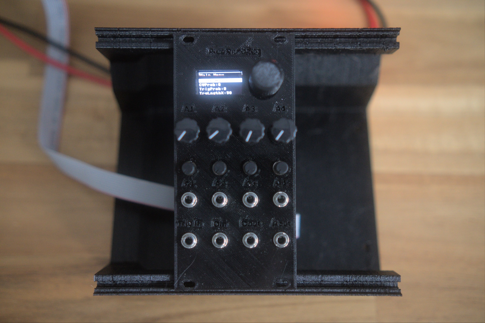

# Pi Pico Random Looping Sequencer



A Raspberry Pi Pico-based Eurorack random / quantized step sequencer with OLED menu, rotary encoder navigation, and **probability-driven variation** on both the CV and trigger sequences. The headline trick: each clock pulse, a configurable probability determines whether the current step's CV (or trigger) gets replaced by a new random value from the chosen musical scale — so the sequence "loops" but slowly mutates as you patch.

Build notes and write-ups on the blog: [diysynthmnl.github.io](https://diysynthmnl.github.io/)

[Demo video on YouTube](https://youtu.be/u1J9JrJe1Y0)

## Features

**Sequencer (firmware):**
- 1 to 16 steps per sequence, user-selectable
- 40+ musical scales (major, minor, dorian, phrygian, blues, pentatonic, hungarian minor, harmonic major, … via [Hector Miller-Bakewell's musical-scales library](https://github.com/hmillerbakewell/musical-scales))
- 1–5 octave CV range
- **CV probability of change** (0–100 %, increments of 5) — how often each step's pitch gets re-randomized on the clock pulse
- **Trigger probability of change** (0–100 %) — same for the trigger output
- **Trigger length** (0–100 % of clock period) — controls gate width
- **CV erase mode** — clamps all steps to scale's root note
- **Trigger erase mode** — sets all triggers to ON
- **Test scale mode** — cycles through scale notes in order (for tuning verification)
- **Tuning scale mode** — alternates between note 12 (1V) and note 24 (2V) (for octave-spacing verification)

**Hardware:**
- 128×64 px SSD1306 OLED display for the menu
- Rotary encoder with push-switch for navigation
- 4 analog parameter inputs (each with jack + attenuator pot + offset pot) → Pico ADC pins
- 1 trigger/clock input
- 1 digital input (for sync, reset, or any gate-like signal)
- 1 digital output (trigger out, with single-transistor buffer to ±5V Eurorack levels)
- 1 quantized CV output via **MCP4725** 12-bit I²C DAC (1V/oct over 5 octaves)
- Eurorack ±12V power (16-pin IDC); local +5V and −5V regulators on board

## Inputs and outputs

| Jack | Function | Wiring |
|---|---|---|
| Analog In 1–4 | Parameter modulation inputs (±5V CV) | Jack → atten (100K) + offset (10K) → MCP6004 → Pico ADC pins GP26–29 |
| Trigger / Clock In | External clock or trigger | Jack → 100K + BAT42 clamps → 2N3904 inverter → GP22 |
| Digital In | Generic digital input (sync, reset, …) | Same topology → GP21 |
| Digital Out | Trigger / gate output | GP23 → 100K → 2N3904 inverter → 10K + 100K → jack |
| vOct Out | Quantized CV (0–5V, 1V/oct) | MCP4725 DAC (I²C, address 0x60) → 100K series → jack |

Front-panel pots / controls:

| Control | Value | Function |
|---|---|---|
| RV2 / RV4 / RV6 / RV8 | 100K | **Analog input attenuator** per channel (1–4) |
| RV1 / RV3 / RV5 / RV7 | 10K | **Analog input offset** per channel (1–4) |
| SW1 | rotary encoder + switch | **Menu navigation** — rotate to scroll items, click to select |

## Pico GPIO pinout (Rev 0.1.0)

| GP | RP2040 function | Connected to | Notes |
|---|---|---|---|
| GP16 | I²C0 SDA | OLED + MCP4725 | Shared bus, both peripherals (addresses 0x3C and 0x60) |
| GP17 | I²C0 SCL | OLED + MCP4725 | Same |
| GP18 | GPIO | Rotary encoder A | |
| GP19 | GPIO | Rotary encoder B | |
| GP20 | GPIO | Rotary encoder switch | Active-low (button to GND) |
| GP21 | GPIO | Digital input | **Inverted** by Q2 2N3904 |
| GP22 | GPIO | Trigger/Clock input | **Inverted** by Q1 2N3904 |
| GP23 | GPIO | Digital output | Drives Q3 2N3904 → jack tip |
| GP26 (ADC0) | ADC | Analog In 4 (per firmware mapping) | |
| GP27 (ADC1) | ADC | Analog In 3 | |
| GP28 (ADC2) | ADC | Analog In 2 | |
| GP29 (ADC3) | ADC | Analog In 1 | **Requires Pico clone with GP29 broken out — see Build notes below** |

## Block diagram

```
                  ╔══════════════════════ HARDWARE ════════════════════╗
                  ║                                                       ║
External CV (±5V) ──[J1–J4]──┬──[RV (100K) atten]──┐                    ║
                              │                    ▼                     ║
                              ▼               [R (100K) summing]         ║
                          [RV (10K) offset]   │                          ║
                               │              │                          ║
                          [+5V/−5V refs]      ▼                          ║
                               │       [MCP6004 inverting amp]           ║
                               └─────────────┤                           ║
                                              │                          ║
                                              ▼ (0 to 3.3V)              ║
                                       Pico GP26–29 (ADC)                 ║
                                                                          ║
Trigger jack ── inverter ──► GP22                                         ║
Digital In   ── inverter ──► GP21                                         ║
                                                                          ║
                  ╔════════════════════ FIRMWARE (MicroPython) ═════════╗
                  ║                                                       ║
                  ║  main loop:                                           ║
                  ║    main_menu.loop_main_menu(update_seq_callback)      ║
                  ║    handle_clock_pulse()  ← detects GP22 edges        ║
                  ║       on rising edge:                                 ║
                  ║         randomly_change_current_step_cv()             ║
                  ║         randomly_change_step_trigger()                ║
                  ║         dac.write(cv_sequence[current_step])          ║
                  ║         current_step += 1 (mod number_of_steps)       ║
                  ║    check_trigger_off()  ← turns off trigger after     ║
                  ║                            trigger_length_ms          ║
                  ║                                                       ║
                  ║  sequencer state:                                     ║
                  ║    cv_sequence[16] = quantized 12-bit DAC values      ║
                  ║    trigger_sequence[16] = 0/1                         ║
                  ║    current_12bit_scale = scale × octaves              ║
                  ║                                                       ║
                  ╚═══════════════════════════════════════════════════════╝
                                              │                          ║
                                              ▼                          ║
GP23 ──► inverter ──► Digital Out jack                                    ║
                                                                          ║
GP16/17 (I²C0) ──► MCP4725 DAC ──► [R23 100K series] ──► vOct Out jack    ║
                                                                          ║
                  ╚═══════════════════════════════════════════════════════╝
```

## Power

- Eurorack ±12V via **J7** (16-pin IDC)
- D6 / D7: reverse-polarity protection
- C4 / C5 (22 µF): bulk rail decoupling on ±12V
- **U3 (78M05): +5V regulator** from +12V → powers MCP4725, Pico VSYS (via D5 BAT42), OLED, transistor pull-ups
- **U4 (79M05): −5V regulator** from −12V → powers the analog input offset network (−5V reference)
- Pico generates its own **+3.3V** (from VSYS via on-board buck converter on the Pico module) → powers MCP6004 op-amps
- C1 / C6 (2.2 µF) regulator output caps, C7 / C3 (100 nF) decoupling

Two power scenarios are supported:
1. **Eurorack power only** — module operates fully
2. **Eurorack + USB** — Pico's USB port can be plugged in concurrently for firmware development. **D5 (BAT42 between +5V rail and Pico VSYS)** prevents USB from back-feeding the Eurorack rail, and prevents Eurorack from feeding the USB host.

## Build notes

### Choose a Pi Pico clone with GP29 (ADC3) broken out

> **This is the most important build decision.** The official Raspberry Pi Pico has GP29 internally tied to VSYS voltage sensing and **is NOT available as an ADC pin**. Many Pico clones (including the one shown in this design, the "Pi Pico Clone Lite Black") break out all 4 ADC pins, including GP29.
>
> If you can't find a clone with GP29 exposed, you have two options:
> - **Reduce to 3 analog inputs** in firmware — omit `cv1 = AnalogueReader(A3)` in `main.py` and adjust the menu / mapping accordingly. The hardware would still have all 4 jacks but the 4th would be unconnected at the Pico.
> - **Use an external ADC** (e.g., MCP3208 over SPI) for the analog inputs — more flexible but requires firmware rework.

Compatible clones tested:
- "Pi Pico Clone Lite Black" — confirmed to have GP29 broken out (used in this design)
- Other clones: check the pinout diagram before buying

### Component selection

- **MCP4725 breakout board** (J8) — common Adafruit / generic breakout, uses I²C address 0x60 (or 0x61, depending on A0 pin). Comes pre-soldered.
- **SSD1306 128×64 OLED** (J… U5) — common eBay / Aliexpress breakout, I²C address 0x3C.
- **MCP6004 quad op-amp** (U1) — rail-to-rail CMOS, runs on +3.3V single supply. DO NOT substitute a TL07x here — those won't swing rail-to-rail and won't reach 0V on the output.

## Calibration

The module has no internal hardware trim pots — calibration is done in software via the firmware's tuning modes.

**Step 1 — Verify 1V/oct tracking using Tuning Scale mode.**

The firmware has a "TuningScale" toggle in the menu. When enabled, it outputs a fixed alternating sequence:

| Step | 12-bit DAC value | Expected voltage at DAC output |
|---|---|---|
| 0 | 816 | 1.000 V (note 12 = first C above 0V) |
| 1 | 1632 | 2.000 V (note 24 = second C) |
| 2 | 816 | 1.000 V |
| ... | ... | ... |

Procedure:
1. Enable TuningScale mode in the menu
2. Patch any clock signal into Trigger/Clock In
3. Scope the vOct Out jack — the output should toggle between two voltages exactly **1.000 V apart**
4. If the spacing is not 1.000 V (typically slightly less, e.g. 0.996 V), the DAC's Vref is slightly off from 5.000 V — see **Design notes — 1V/oct precision** for the math and fix options

**Step 2 — Verify GP29 (ADC3) is working.**

If you're using a clone with GP29 exposed, patch a CV into Analog In 1 (which maps to GP29 / ADC3 per the firmware) and verify it shows up correctly in any analog-input-driven menu (note: as of Rev 0.1.0 of the firmware, analog inputs are wired to hardware but the main loop's analog reading code is `TODO`'d out — see [issue #2](../../issues)).

## Development workflow

1. Power the module via Eurorack (±12V)
2. Plug a USB cable into the Pico (this is safe; D5 prevents back-feeding)
3. Use **VSCode with the [MicroPico extension](https://marketplace.visualstudio.com/items?itemName=paulober.pico-w-go)**
4. Common commands:
   - `MicroPico: Delete all files from pico` — wipe before fresh upload
   - `MicroPico: Upload project files to pico` — sync `Software/` to the Pico
   - `MicroPico: Run` — execute `main.py`

The Pico runs **MicroPython** firmware (not C/C++ SDK). MicroPython is slower but dramatically easier to iterate on — and the timing precision required for a step sequencer (a few ms of clock-edge accuracy) is well within MicroPython's capabilities on the RP2040.

## Borrowed firmware libraries

Two external libraries are vendored into `Software/lib/`:

- **`analog_reader.py`** — adapted from [EuroPi by Allen Synthesis](https://github.com/Allen-Synthesis/EuroPi) (Apache License 2.0). `AnalogueReader` class with `percent()`, `range()`, `choice()` helpers and over-sampling for noise reduction. Local additions: `invert` flag, `map_value()` helper.
- **`mcp4725_musical_scales.py`** — built on top of [Hector Miller-Bakewell's musical-scales](https://github.com/hmillerbakewell/musical-scales) library (MIT). Defines 40+ scale intervals and a `get_scale_of_12_bit_values()` helper that converts note numbers to MCP4725 DAC counts.

Other vendored libs (`ssd1306.py`, `rotary.py`, `rotary_irq_rp2.py`, `mp_button.py`, `mcp4725.py`) are standard MicroPython drivers — credited in each file's header.

Original code: `main.py`, `menu.py` (custom OLED menu system), `musical_scales.py` (Rex's wrapper around the above).

## Design notes

### 1V/oct precision math

The MCP4725 is a 12-bit DAC with Vref = VCC = 5V (powered from the local 78M05 regulator). Resolution: 5V / 4096 = **1.221 mV per count**.

For 1V/oct over 12 semitones, the ideal step is **83.33 mV per semitone**. The firmware uses `multiplier = 68` counts per semitone → 68 × 1.221 mV = **82.99 mV per semitone** — that's 0.34 mV short, or about **7 cents flat per octave**. Compounded over 5 octaves at the top of the range: ~35 cents flat at the top C.

Fix options (in order of effort):
1. **Use a tuning lookup table** in firmware that adjusts each note's DAC count individually — captures the per-octave error. Requires bench-measured calibration data.
2. **Trim the +5V regulator's output** slightly high (e.g., to 5.083 V) so 4080 counts = 5.000 V exactly. But this affects the OLED and the digital output level too.
3. **Add a 1V/oct gain trim** in hardware: replace R23 with an op-amp buffer + gain trim that scales the DAC output up by ~0.4 %. This is the canonical Eurorack approach.

### MCP4725 output buffering

R23 (100K) is the only thing between the DAC's output pin and the vOct Out jack — **there is no buffer op-amp.** With a typical Eurorack input impedance of 100K, this forms a 1:1 voltage divider that **halves the output voltage**.

**This is a real concern** — needs bench verification:
- Scope J9 with no load → should match the DAC voltage (no divider)
- Scope J9 driving a typical 100K Eurorack input → if voltage is halved, you have ~0.5 V/oct instead of 1 V/oct
- Fix: insert a unity-gain TL07x buffer between the DAC output and R23 (or replace R23 with the buffer)

See [issue #1](../../issues).

### Analog input mapping

The MCP6004 op-amps run from +3.3V single supply. Their output must stay within 0–3.3V to be readable by the Pico's ADC. The input network does the mapping:

```
External CV (±5V) ──[100K attenuator (RV2 fully open)]──┐
                                                        │
+5V/−5V offset ──[10K offset pot]──[100K]──┐            │
                                            │            ▼
                                            ▼      [100K input R]
                                       [100K input R]    │
                                            └───────────┤
                                                        │
                                       (inverting summing junction)
                                                        │
                                                        ▼
                                           [MCP6004 inverting amp, 100K feedback]
                                                        │
                                                        ▼
                                                  Pico ADC (0–3.3V)
```

The math is: at the inverting input, the contributions sum. The op-amp output is `−(V_in/100K + V_offset/100K) × 100K = −(V_in + V_offset)`. With a +5V supply and clamping to 0–3.3V, the effective input range is roughly `+1.7V to −3.3V` external → `0V to 3.3V` at the ADC. This is asymmetric — the input is biased toward processing positive-going CVs.

For symmetric ±5V CV mapping, the offset pot RV1/3/5/7 should be set to bias the op-amp output near 1.65V (mid-range) at 0V external input. Calibration procedure for this is currently undocumented — see [issue #3](../../issues).

## Inspirations and prior art

This module sits in the "random / generative sequencer" family. Direct inspirations:
- **EuroPi (Allen Synthesis)** — the analog reading pattern is borrowed from here; EuroPi is the open-source progenitor of "Pi Pico + Eurorack" modules
- **Music Thing Modular Turing Machine** — the "looping but mutating" concept (Rex's "probability of change" is structurally similar to Turing's "lock probability")
- **Mutable Instruments Marbles** — random CV + trigger generation with probability-of-change parameters

This module is **MicroPython on a Pi Pico** — simpler firmware than EuroPi (which is a full Allen-Synthesis-maintained framework) but with comparable hardware capability.

## References

Local archived copies live in [`references/`](references/) so this repo stays useful if the upstream links die.

- **RP2040 datasheet (Raspberry Pi)** — [local copy](references/RP2040-datasheet.pdf) · [upstream](https://datasheets.raspberrypi.com/rp2040/rp2040-datasheet.pdf)
- **MCP4725 datasheet (Microchip)** — [local copy](references/MCP4725-Microchip.pdf) · [upstream](https://ww1.microchip.com/downloads/en/devicedoc/22039d.pdf) — 12-bit DAC, I²C
- **MCP6001/2/4 datasheet (Microchip)** — [local copy](references/MCP6001-2-4-Microchip.pdf) · [upstream](https://ww1.microchip.com/downloads/aemDocuments/documents/MSLD/ProductDocuments/DataSheets/MCP6001-1R-1U-2-4-1-MHz-Low-Power-Op-Amp-DS20001733L.pdf) — covers the MCP6004 quad op-amp
- [Raspberry Pi Pico full datasheet (with on-module Pico-specific info)](https://datasheets.raspberrypi.com/pico/pico-datasheet.pdf) — not archived locally (17 MB), but worth bookmarking
- [EuroPi project (Allen Synthesis)](https://github.com/Allen-Synthesis/EuroPi) — `analog_reader.py` source
- [musical-scales library (Hector Miller-Bakewell)](https://github.com/hmillerbakewell/musical-scales) — `mcp4725_musical_scales.py` source
- [Build blog: diysynthmnl.github.io](https://diysynthmnl.github.io/) — Rex's running notes on this build

## Build status

What's ready for builders today, and what's still on the TODO list:

**Production assets** (what you need to actually fabricate and assemble a final unit)

- [x] Schematic — Rev 0.1.0 ([pi-pico-random-looping-sequencer-schematic-rev-0.1.0.pdf](Hardware/Schematics/pi-pico-random-looping-sequencer-schematic-rev-0.1.0.pdf))
- [ ] PCB layout — in progress — single working layout in `Hardware/pi-pico-random-looping-sequencer/`, not yet separated for fab
- [ ] Gerber files for fabrication — none yet
- [ ] BOM — none yet
- [ ] Final front panel (SVG/PDF for fab) — none yet
- [x] License — [LICENSE](LICENSE) (MIT)

**Prototype assets** (for breadboard / perfboard / 3D-printed-panel builds before final PCB)

- [x] 3D-printed prototype panel STL — [pico-rand-loop-V2.stl](Hardware/3D%20printed%20panel/pico-rand-loop-V2.stl)

**Firmware**

- [x] Working sequencer firmware — [`Software/main.py`](Software/main.py)
- [x] MicroPython libraries vendored in [`Software/lib/`](Software/lib/)
- [ ] Implement reading from the 4 analog input jacks (currently TODO in main loop — see [issue](../../issues))
- [ ] Per-note tuning lookup table (improves 1V/oct precision — see Design notes)
- [ ] Save/load patterns to flash (currently lost on power-cycle)

**Documentation**

- [x] Photos of the assembled module — see [photos/](photos/)
- [x] Demo video — [watch](https://youtu.be/u1J9JrJe1Y0)
- [ ] Build / assembly instructions — none yet
- [x] Calibration procedure — see Calibration section above

Want to help fill a gap (build photos, gerbers, an assembly guide)? Open an issue or PR.
